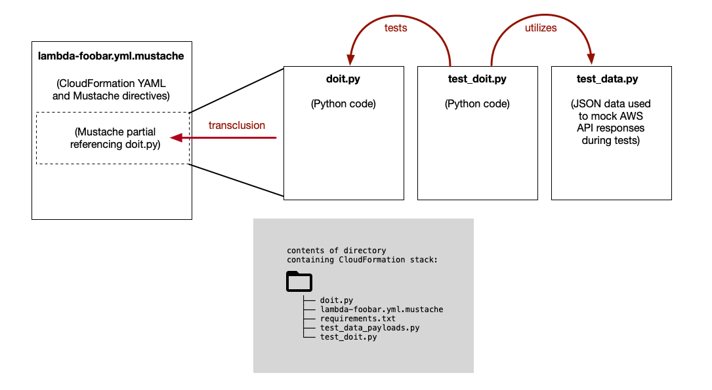

# CloudFormation Transclusion Pattern for Lambdas and SSM Automations

The Readme for the example in the `example-block-ip/` directory
[is here](example-block-ip/Readme.md).

## Table of Contents

* [Overview](#overview)
* [Tools And Services Used](#tools-and-services-used)
  * [Tools](#tools)
  * [AWS Services](#aws-services)
* [Where the Transclusion Pattern is Useful](#where-the-transclusion-pattern-is-useful)
* [Changing Mustache Delimiters](#changing-mustache-delimiters)
* [YAML Example](#yaml-example)
  * [Before](#before)
  * [The Solution](#the-solution)
  * [After](#after)
* [Roles and Permissions](#roles-and-permissions)

## Overview

This repository demonstrates a way of writing and organizing
YAML documents for AWS CloudFormation in a way that keeps
the YAML separate from code.

(What is transclusion? Transclusion is the inclusion of a document
or file by means of reference, not by copying.)



## Tools And Services Used

### Tools

We're using **Mustache.js** as a pre-parser for the CloudFormation YAML (not by choice, believe me, we would prefer Jinja2).
That means we are writing CloudFormation templates in _mostly_ YAML, and _small bits_ of Mustache.

We're using **Python** as a scripting language (this is the main supported scripting language
for SSM Automations, plus Python is awesome).

### AWS Services

We're using AWS **CloudFormation**, and writing CF templates in YAML, also including some Mustache templating.

We're using AWS **Systems Manager Automations** (SSM Automations) to write serverless playbooks that operators
can run. (The particular application here is incident response.)

We're using AWS **Web Application Firewall** (WAFv2) to manage requests to a web server.
(The example we cover below automates a change to the WAF.)

## Where the Transclusion Pattern is Useful

The transclusion pattern is useful when defining a lambda function
inline in a CloudFormation template.

That's usually the case when defining and deploying lambda functions
that are fairly simple - but still complicated enough to require tests.

This pattern becomes extremely useful for defining SSM Automations.
SSM Automations can consist of multiple steps, and each step may have a bit
of Python code that is deployed into a lambda function, so the amount of
code can quickly grow, and maintaining and testing that code can be a mess.

This pattern can also be useful for bash scripts, or for the UserData section of an
EC2 instance (which contains a shell script that is run on boot), or anywhere
else a snippet of code is included inline in a CloudFormation template.

## Changing Mustache Delimiters

Before we begin, it's important to note that double braces `{{ }}` are very overloaded
in CloudFormation templates. They are used by AWS CloudFormation, AWS Systems Manager,
and Mustache.js, so double braces can have a different meaning in different contexts,
even within the same document. It can also cause confusion about intent.

Before we start, we will switch out Mustache delimiter characters for something
unambiguous. We'll use `<%` and `%>`.

To swap out the double braces `{{` and `}}` with `<%` and `%>`,
put the following at the beginning of the CloudFormation YAML Mustache template:

```
{{=<% %>=}}
```

We put it at the very top of the file so there's no mistake - double braces
will never refer to Mustache.js variables in this YAML file.

## YAML Example

This briefly covers portions of an example CloudFormation template.
The full template is in the `example-block-ip/` directory.

For more details about the example, see the Readme for the example in the `example-block-ip/` directory
[here](example-block-ip/Readme.md).

### Before

Here's an example of a single SSM Automation step defined in CloudFormation YAML.
This SSM Automation step is passed an input (the output of the prior automation step),
and runs a Python script on that input.

```
          - name: BLOCK_IpAddress
            description: !Sub |
              Step Summary

              ** Add the user-specified IP address to the WAF IP block list. **

            action: 'aws:executeScript'
            inputs:
              Runtime: python3.8
              Handler: script_handler
              InputPayload:
                ip_list: "{{ IpAddressList }}"
                block_list_ruleset_name: "{{ BlockListName }}"
                block_list_ssmparam_name: "/DeploymentConfig/{{ env }}/BlockedIPs"
                waf_operation: "{{ Operation }}"
              Script: |
                import logging
                import time
                import json
                import boto3
                import ipaddress
                
                waf_client = boto3.client('wafv2')
                ssm_client = boto3.client('ssm')
                
                def script_handler(events, context):
                    [...]
```

There are problems with shimming Python code directly into CloudFormation YAML:

* It's messy to read
* It's putting Python code into a YAML file, so text editors with syntax highlighting get very confused
* It's impossible to test this code or run it locally
* Indentation between YAML (2 spaces) and Python (4 spaces) does not match
* The YAML file that results cannot be properly YAML-linted
* The code embedded in the YAML file cannot be properly Python-linted

We could go on.

### The Solution

We need to separate the CloudFormation YAML from the Python code, and we can
do that by replacing the block of Python code with a Mustache.js transclusion
directive that points to a .py file.

The Mustache.js term for this is "partials" - as in, you're referencing
a "partial" file to be included in another file.

Normally the syntax for including partials looks like `{{> foo.file}}`,
but with our new Mustache delimiters this becomes `<%> foo.file%>`.

### After

The SSM Automation above now becomes:

```
          - name: BLOCK_IpAddress
            description: !Sub |
              Step Summary

              ** Add the user-specified IP address to the WAF IP block list. **

            action: 'aws:executeScript'
            inputs:
              Runtime: python3.6
              Handler: script_handler
              InputPayload:
                ip_list: "{{ IpAddressList }}"
                block_list_ruleset_name: "{{ BlockListName }}"
                block_list_ssmparam_name: "/DeploymentConfig/{{ env }}/BlockedIPs"
                waf_operation: "{{ Operation }}"
              Script: |
<%> block_ip.py%>
```

The file `block_ip.py` is a normal, standard, standalone Python script
with normal indentation. The contents of the Python script are transcluded
into the CloudFormation template during the Mustache.js pre-processing step.

The Mustache.js pre-processing step renders all Mustache variables in the
Mustache template, and outputs a YAML file that is ready to be uploaded to
CloudFormation to be deployed.

The final CloudFormation YAML file that is uploaded to CloudFormation will
contain a mix of YAML and Python - a bit like oil and water.
But thanks to the transclusion method, these two ingredients are kept separate
during development and are only mixed in the final stage of deploying the stack.

## What Next?

We highly encourage you to check out the Readme
for the transclusion pattern example, in the `example-block-ip/` directory.
A link to that [Readme.md is here. Right here. No - yup, you got it, just click right here. On this text.](example-block-ip/Readme.md).
Nope, not on this text. Back up.
