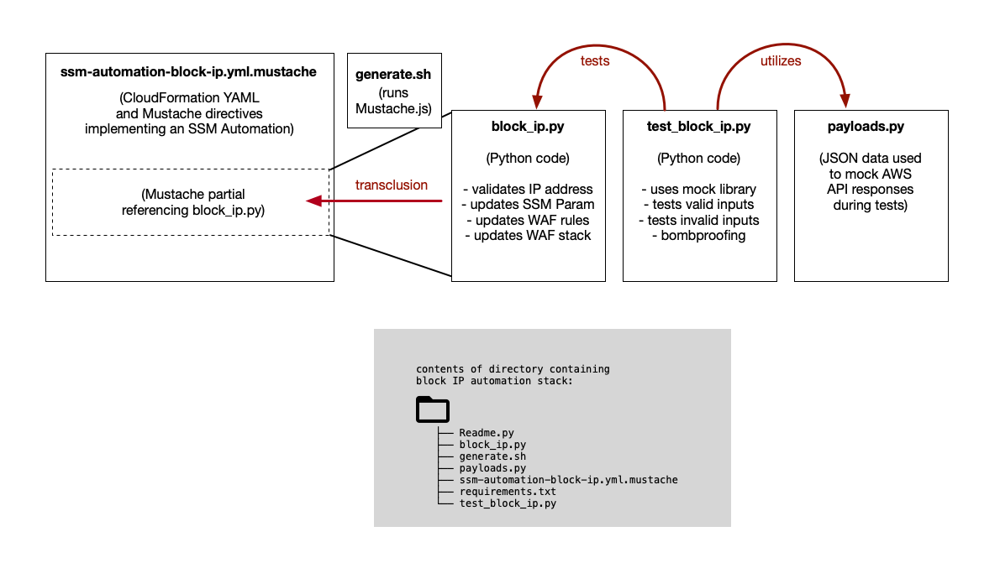

# CloudFormation Transclusion Pattern: Block IP Example

## Table of Contents

* [Overview](#overview)
* [Python Files](#python-files)
* [Mustache Pre\-Processing](#mustache-pre-processing)
* [Local Testing](#local-testing)
* [Note on Roles and Permissions](#note-on-roles-and-permissions)

## Overview

This directory contains an example of a CloudFormation template using the transclusion pattern.

This CloudFormation template implements an SSM Automation to block an IP address.
This action requires updating an SSM Parameter that contains a list of IP addresses to block,
and then updating the web application firewall (WAF) to update its block list 
to use the new list of IP addresses.

The SSM Automation has multiple steps. The final step of the automation
runs a Python function that validates the user-provided IP address to block,
updates the AWS SSM Parameter containing blocked IPs, and updates the WAF's
block list.



## Python Files

The Python script that is run by the final step of the automation is in `block_ip.py`.

This file also has a test harness with several tests (checking behavior with both
good and bad inputs) in `test_block_ip.py`.

The tests utilize Python's mock library to mock responses from the AWS API.
The file `payloads.py` contains JSON payloads that are used by the mock library.
Most of these were obtained by using the AWS CLI to run a particular command,
copying the JSON returned by the CLI, and using that JSON to mock future API calls.

## Mustache Pre-Processing

The transclusion pattern maintains a clean separation between CloudFormation YAML and 
Python code, but the last step is to mix them together by running the CloudFormation
Mustache templates through Mustache.

To do that, we use the `generate.sh` script.

## Local Testing

For each Python script that has a lambda function handler in it,
there should be a corresponding test file that will mock the AWS API.

To test lambda function code, we must mock the lambda event/context,
plus any API calls to AWS services. In this case, we must mock the
AWS WAFv2 API.

Tests use the `unittest` library's `unittest.mock` to mock responses from
`boto3` calls.  The file `payload.py` defines JSON data structures returned
by the mocked API calls. (These payloads are constructed by manually making
API calls using the AWS CLI, and copying the payload returned by AWS.)

To run tests, start by setting up a virtual environment called `vp`:

```
python3 -m venv vp
```

To activate the virtual environment:

```
source vp/bin/activate
```

To install required Python libraries, specified in `requirements.txt`:

```
vp/bin/pip install -r requirements.txt
```

You should now have pytest installed. If you run `which pytest` you should see
a path to a `pytest` binary in the `vp/bin` directory.

To test the Python function, run `pytest -vs` (the `-v` command means verbose,
the `-s` command means pass stdout through):

```
pytest -vs
```

This will automatically detect all unit tests in the current directory and run them.

## Note on Roles and Permissions

When defining an SSM Automation, you can specify a role for the Automation
to assume when it runs.

If an SSM Automation does not have a role specified, it will run each step as the
user who kicked off the automation.

In the example CloudFormation template, we commented out the user input parameter
specifying the role to assume. To use an assumed role, simply uncomment it.
